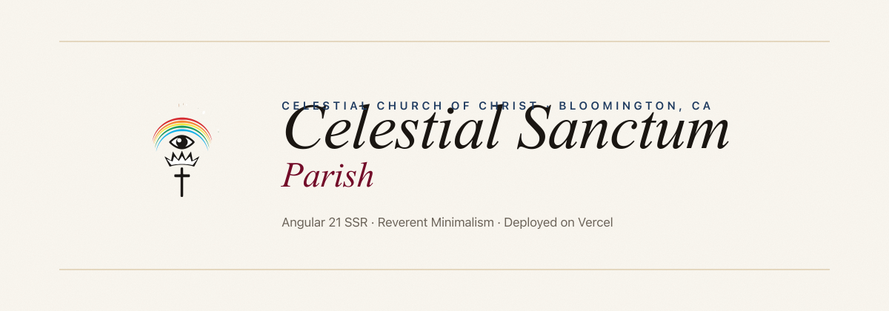
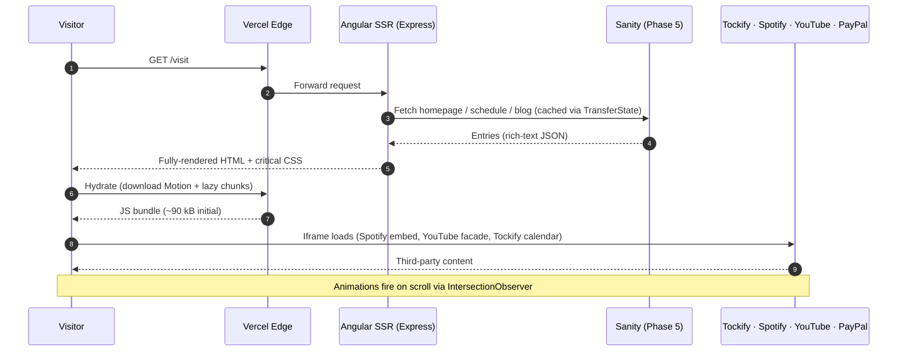

<picture>
  <source media="(prefers-color-scheme: dark)"  srcset="assets/banner-dark.png">
  <source media="(prefers-color-scheme: light)" srcset="assets/banner-light.png">
  
</picture>

[](https://github.com/Builder106/celestial-sanctum/actions/workflows/ci.yml)
[](https://angular.dev)
[](https://www.typescriptlang.org/)
[](https://tailwindcss.com)
[](#license)
[](https://celestial-sanctum.vercel.app)

A light, reverent rebuild of [celestialsanctumparish.org](https://www.celestialsanctumparish.org) — an Angular 21 SSR site for **Celestial Sanctum Parish**, a parish under the Celestial Church of Christ in Bloomington, California. Replaces the live site's dated Bootstrap-era layout with a Reverent Minimalism design system: Cormorant Garamond display + Inter body on a cream / ink / brass-gold / celestial-blue palette, with a Motion-One animation system tuned for the parish's liturgical tradition.

## How it works



The architecture chooses **SSR + prerender for SEO** (static pages prerender at build; dynamic pages SSR per request), **lazy-loaded route chunks** (~3–13 kB each), and **first-paint priority for hero photography** (`` on the sutana hero photo).

## Demos

<details>
<summary><strong>Home — cinematic hero, mission, "Come and see", pastor's letter, Sunday rhythm, 24/7 livestream, podcast, burgundy closer</strong></summary>

> Demo recording pending — Gherkin E2E suite + video recordings are queued for Phase 7 polish.

</details>

<details>
<summary><strong>About — long-form scrolling with sticky anchor TOC + seven parish sections</strong></summary>

> Demo recording pending.

</details>

<details>
<summary><strong>Visit — first-time-visitor doorway, weekly schedule, map, service walkthrough, FAQ</strong></summary>

> Demo recording pending.

</details>

<details>
<summary><strong>Watch & Listen — consolidated media hub (Spotify, YouTube live, blog teasers from live WordPress)</strong></summary>

> Demo recording pending.

</details>

<details>
<summary><strong>Animation system — letter reveal, cascade, Sanctum-mark draw-in, route fade</strong></summary>

> Demo recording pending. Live preview at [`/__styleguide`](https://celestial-sanctum.vercel.app/__styleguide).

</details>

## Stack

| Layer | Choice |
|---|---|
| Framework | Angular 21 with `@angular/ssr` and `@angular/animations` |
| Styling | Tailwind v4 via `@tailwindcss/postcss` + `@theme` tokens |
| Typography | Cormorant Garamond (display) + Inter (body), self-hosted via `@fontsource` |
| Animation | Motion One (~5 kB lazy-loaded) + custom directives |
| CMS | Sanity ([see setup](./SANITY_SETUP.md)) |
| Hosting | Vercel — Production at [celestial-sanctum.vercel.app](https://celestial-sanctum.vercel.app) |
| Telemetry | `@vercel/analytics` + `@vercel/speed-insights` |
| CI | GitHub Actions — preview deploys on PRs, production on `main` |

## Local development

```bash
git clone https://github.com/Builder106/celestial-sanctum.git
cd celestial-sanctum
npm install
npm start                  # ng serve on :4200 with SSR + HMR
```

See [CONTRIBUTING.md](./CONTRIBUTING.md) for project structure, conventions, commit-message style, and out-of-scope items.

## Project status

The site is broken into nine phases. Phases 0–4 are live in production; Phase 5+ are open.

- ✅ **Phase 0** — Angular 21 SSR scaffold + Tailwind v4 + Cormorant/Inter tokens
- ✅ **Phase 1** — Reverent design system (button directive, eyebrow, hairline, display, card, quote, drop-cap, Sanctum mark, icon set, header, footer)
- ✅ **Phase 2** — `/visit` + `/about` (long-form with sticky TOC) with verbatim parish content
- ✅ **Phase 3** — `/watch` (Spotify + YouTube live + 5 real blog posts)
- ✅ **Phase 4** — `/calendar` (Tockify placeholder) + `/give` (PayPal) + `/contact` (form, awaiting backend)
- 🟡 **Phase 5** — Sanity migration (homepage + pastor wired; remaining sections pending — [see setup](./SANITY_SETUP.md))
- ⏳ **Phase 6** — Vercel serverless functions for contact / prayer / newsletter
- ⏳ **Phase 7** — SEO + redirects from legacy `.php` URLs + sitemap + Lighthouse pass
- ⏳ **Phase 8** — DNS cutover

## License

[MIT](./LICENSE).
